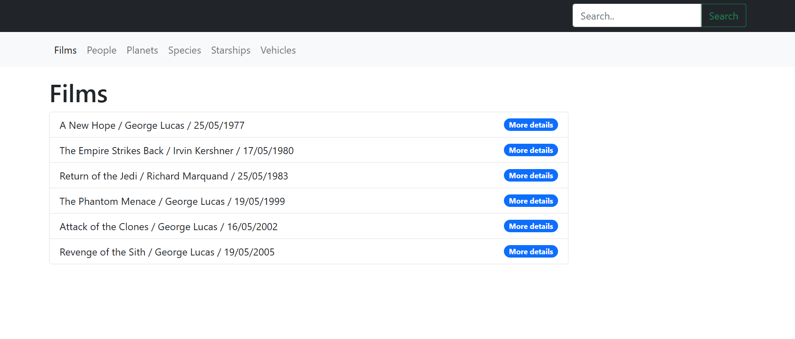

# Crealogix FE - Prueba Técnica

Este proyecto es una prueba técnica desarrollada en **Angular 12.2.10** y **Bootstrap v5.0.2**. Su objetivo es consumir la **API de Star Wars** ([SWAPI](https://swapi.dev/documentation#intro)). La API brinda información sobre películas, personajes, planetas, especies, naves espaciales y vehículos de Star Wars.

---

## Instalación y ejecución

1. Clona este repositorio en tu máquina local `git clone https://github.com/fhidalgorosabal/swapi-technical-test.git`.
2. Accede a la carpeta del proyecto `cd swapi-technical-test`.
3. Ejecuta `npm install` para instalar los paquetes de node.
4. Para iniciar la aplicación `ng serve` y accede en el navedador a `http://localhost:4200/`.

---

## Capturas de pantalla

### Películas

### Personas

### Búsqueda

---

## Autor

Desarrollado por: Fernando Hidalgo Rosabal.

---

## Licencia

Este proyecto está licenciado bajo la [Licencia MIT](https://opensource.org/licenses/MIT).

---